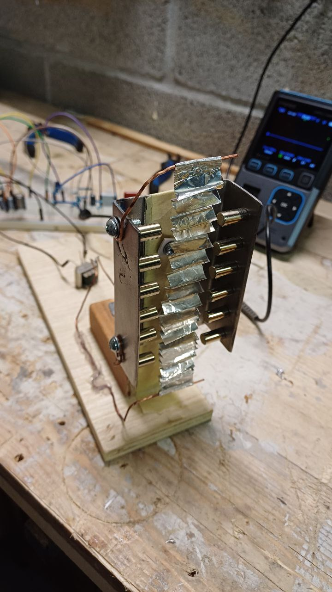

# 🎙️ DIY Ribbon Microphone

A handmade experimental build of a ribbon microphone using basic components and salvaged materials. The project was developed as a learning exercise, with no expectations of professional audio quality, but with the goal of understanding the physical and electrical behavior of ribbon microphones.

---

## 🧱 Physical Structure

* **Steel C-channel profile** (~10 cm), mounted vertically on a **wooden base**
* **Neodymium magnets** (6 per side) fixed inside the open faces of the profile
* **Aluminum foil folded accordion-style** (total length unfolded ~23 cm, width ~2 cm, estimated thickness <15 µm)
* The foil is electrically connected to two **copper wires**, mechanically secured to the main steel body

---

## 📏 Electrical Measurements

* Measured resistance across the ribbon (after improving contacts): Around **4 Ω** (professional microphones are <1 Ω. A reasonable value for a DIY ribbon, considering contact quality, folding, and materials!)

---

## 🔁 Step-Up Transformer

* Step-up transformer with a 1:2 ratio (recycled from... somewhere)

  * Primary: 25 Ω (connected to the ribbon)
  * Secondary: 50 Ω (connected to the preamp)
* Purpose: to increase the output signal voltage and help with impedance matching

NOTE! A ratio of 1:35 might be the best for this, but step-up transformers are usually very expensive!

---

## 🔊 Preamplifier

* Simple transistor preamp (BC547), originally designed for 500 Ω playback heads (built from a Philips scheme)
* Single-ended (unbalanced) input: connected to the secondary of the transformer

  * **One transformer wire → preamp input** (via 1.5 µF capacitor)
  * **Other transformer wire → ground**
* Output taken after the final DC-blocking capacitor

---

## 🔌 Power Supply

9V battery

---

## 📺 Oscilloscope

* Oscilloscope used for system debugging: At least an Portable FNIRSI (which worked rather good)
* Connection:

  * Probe tip to preamp output
  * GND clip to power/common ground
* Initial mode: **DC coupling** (to observe potential offset)
* Then switched to: **AC coupling** (to view audio waveform cleanly)

NOTE: The outcome for both DC and AC was pretty much the same.

---

## 🧪 Future Improvements

* Upgrade to a higher-ratio step-up transformer (e.g. 1:35)
* Add electromagnetic shielding and a protective enclosure
* Attach to the microphone an XLR (Cannon) cable
* Perform audio tests via sound card or USB interface

---

## 📚 Notes

This project is useful for a better understand of:

* How ribbon microphones work
* The relationship between mechanical vibration and electrical signal
* Basic analog amplification and filtering techniques
* How to use an oscilloscope
