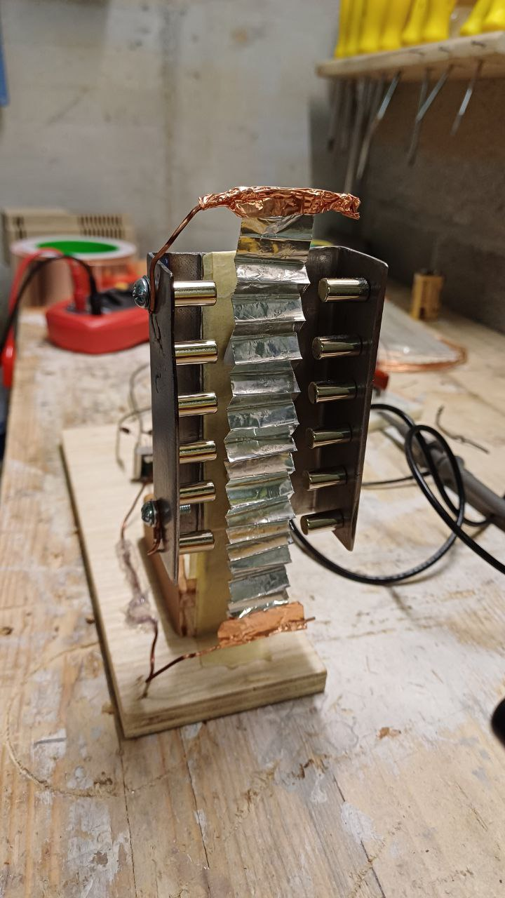
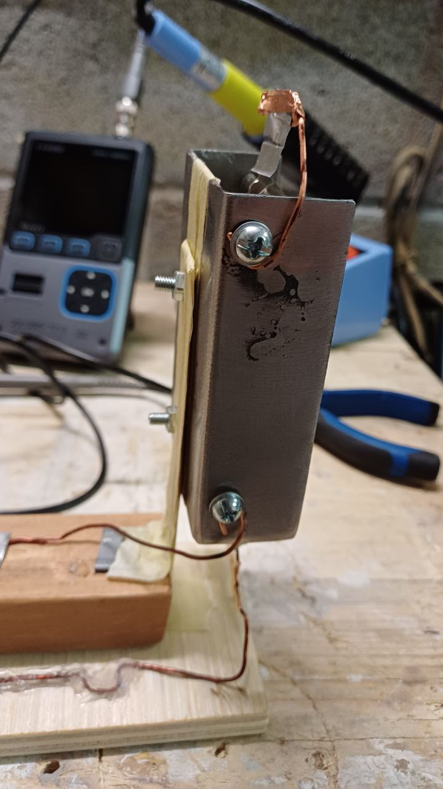
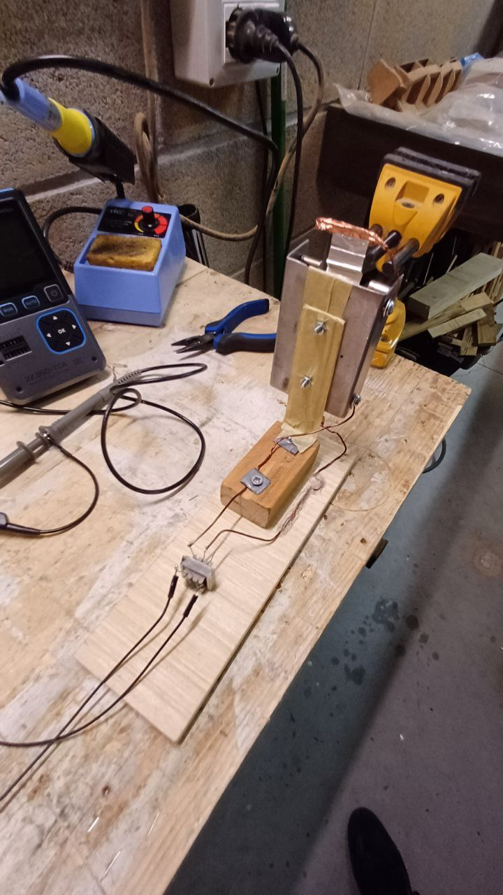
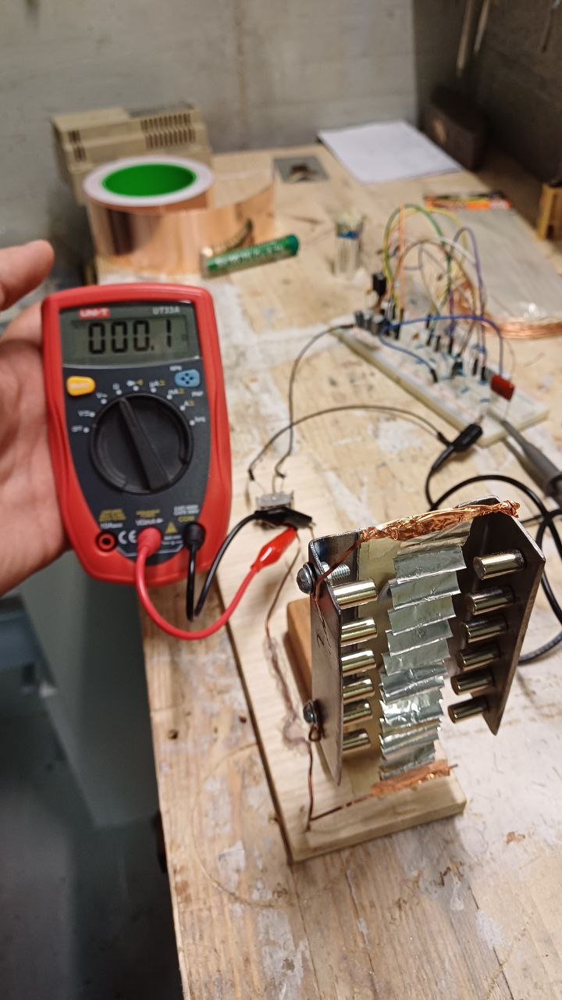
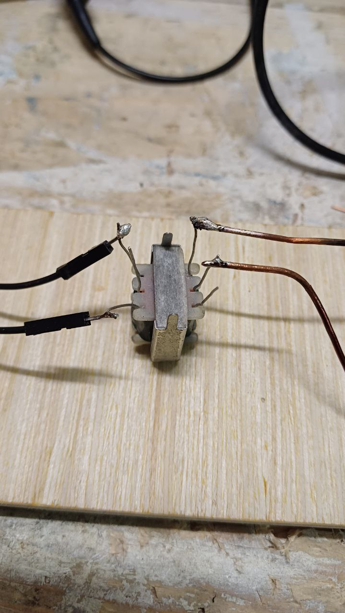
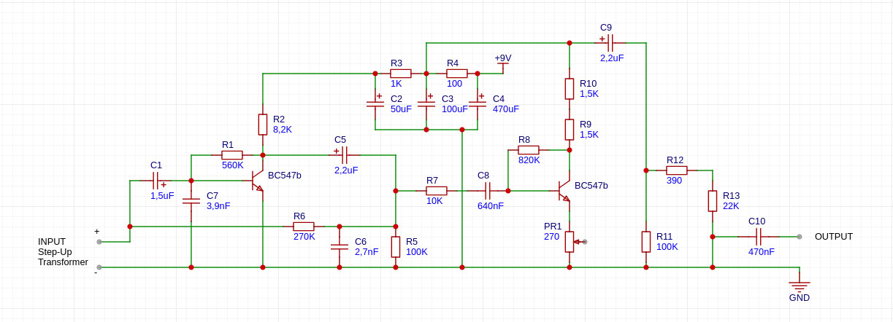

# 🎙️ DIY Ribbon Microphone

A handmade experimental build of a ribbon microphone using basic components and salvaged materials. The project was developed as a learning exercise, with no expectations of professional audio quality, but with the goal of understanding the physical and electrical behavior of ribbon microphones.

A detailed description on how I built it can be found in both [English](dyi_ribbon_microphone_how_i_built_it_en.pdf) and [Italian](dyi_ribbon_microphone_how_i_built_it_it.pdf)

---

## 🧱 Physical Structure

* **Steel C-channel profile** (~10 cm), mounted vertically on a **wooden base**
* **Neodymium magnets** (6 per side) fixed inside the open faces of the profile
* **Aluminum foil folded accordion-style** (total length unfolded ~23 cm, width ~2 cm, estimated thickness <15 µm). Make sure it's stretched enough between copper wires
* The foil is electrically connected to two **copper wires**, mechanically secured to the main steel body
* The C-shaped steel profile is completely electrically insulated from the bracket that supports it

---

## 📏 Electrical Measurements

Measured resistance across the ribbon: Around **0,1 Ω** 

---

## 🔁 Step-Up Transformer

* Step-up transformer with a 1:2 ratio (recycled from... somewhere)

  * Primary: 25 Ω (connected to the ribbon)
  * Secondary: 50 Ω (connected to the preamp)
* Purpose: to increase the output signal voltage and help with impedance matching

NOTE: A ratio of 1:35 might be the best for this thing, but step-up transformers are usually very expensive!

---

## 🔊 Preamplifier

* Simple transistor preamp (BC547)
* Single-ended (unbalanced) input: connected to the secondary of the transformer

  * **One transformer wire → preamp input** (via 1.5 µF capacitor)
  * **Other transformer wire → ground**
* Output taken after the final DC-blocking capacitor

NOTE: This preamplifier is designed for a tape head with a 500 Ω impedance, which is far higher than what’s needed for this particular application, therefore the output is rather low. However, it was the only preamplifier circuit I could find in a book.

---

## 🔌 Power Supply

A **stable** power source from 7,5V to 12V / 9V battery (as I did)

NOTE: Do not use any square wave generator even if might be working for other applications. It would generate lots of disturbance and you get a very dirty output.

---

## 📺 Oscilloscope

* Oscilloscope used for system debugging: At least a Portable FNIRSI (which worked rather good)
* Connection:

  * Probe tip to preamp output
  * GND clip to power/common ground
* Initial mode: **DC coupling** (to observe potential offset)
* Then switched to: **AC coupling** (to view audio waveform cleanly)

NOTE: The outcome for both DC coupling and AC coupling was pretty much the same.

---

## 🧪 Future Improvements

* Improve foil contacts on both copper wires by using Copper Tape
* Upgrade to a higher-ratio step-up transformer (e.g. 1:35 ratio) for a "louder" output
* Adapt the pre-amplifier input to match Step-Up transformer impedance
* (optional) Add electromagnetic shielding and a protective enclosure
* Attach to the microphone or preamp an XLR (Cannon) cable

---

## 📚 Notes

This project is useful for a better understanding of:

* How ribbon microphones work
* The relationship between mechanical vibration and electrical signal
* Basic analog amplification and filtering techniques
* How to use an oscilloscope
